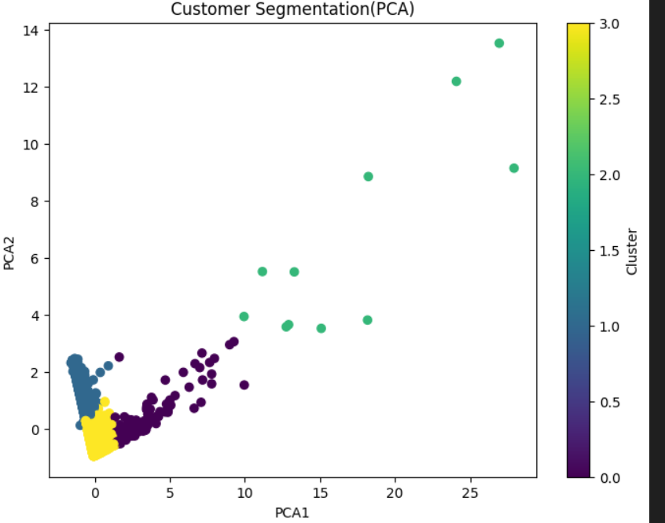

## Customer Segmentation using K-Means Clustering

##  Project Overview
This project demonstrates **customer segmentation** using the **Online Retail Dataset**. The main goal is to group customers into different segments based on their purchasing behavior, so businesses can design targeted marketing strategies, loyalty programs, and personalized offers.

Clustering is done using the **K-Means algorithm**, which is an unsupervised machine learning technique widely used for pattern recognition and segmentation.


##  **Main Objective**
Identify different groups of customers (high-value, medium-value, low-value).
Understand customer purchase behavior using **RFM Analysis**:
   **Recency**: How recently a customer made a purchase.
   **Frequency**: How often they purchase.
  **Monetary**: How much money they spent.


##  **Steps Involved**
1. **Data Loading & Cleaning**
    Removed missing values (`Description`, `CustomerID`).
    Dropped duplicate rows.
    Filtered out negative `Quantity` and `UnitPrice` values.
   
2. **Feature Engineering**
    Created **TotalPrice** = `Quantity × UnitPrice`.
    Created **RFM table**:
      `Recency` = Days since last purchase.
      `Frequency` = Number of unique invoices.
       `Monetary` = Total spending.
   
3. **Data Preprocessing**
   - Standardized features using **StandardScaler** (K-Means works better with scaled data).
   
4. **K-Means Clustering**
   - Used **Elbow Method** to find optimal `k`.
   - Built the model with **4 clusters**.
   
5. **Visualization**
   - Used **PCA (Principal Component Analysis)** to reduce dimensions and visualize clusters in 2D.
   - Created scatter plot to show different clusters.


##  **Technologies Used**
 **Python**
 **Libraries**:
   `pandas` – Data manipulation
   `numpy` – Numerical operations
   `scikit-learn` – K-Means, StandardScaler, PCA
   `matplotlib` – Visualization


##  **Business Use Case**
By segmenting customers into clusters, businesses can:
 Reward **high-value customers** with loyalty programs.
 Engage **medium-value customers** with discounts.
 Re-engage **dormant customers** through campaigns.


## **Cluster Visualization**
Below is the visualization of clusters after applying PCA:



##  **Result**
The clustering process successfully grouped customers into distinct segments. Each cluster represents customers with similar purchasing patterns:
**Cluster 0**: High spenders, frequent buyers.
 **Cluster 1**: Medium spenders, occasional buyers.
 **Cluster 2**: Low spenders, infrequent buyers.
 **Cluster 3**: Dormant customers.

## 🚀 **How to Run**
1. Clone this repository:
   ```bash
   git clone https://github.com/SatyanarayanaAkula2/CustomerSegmentation.git
   cd customer_segmentation
